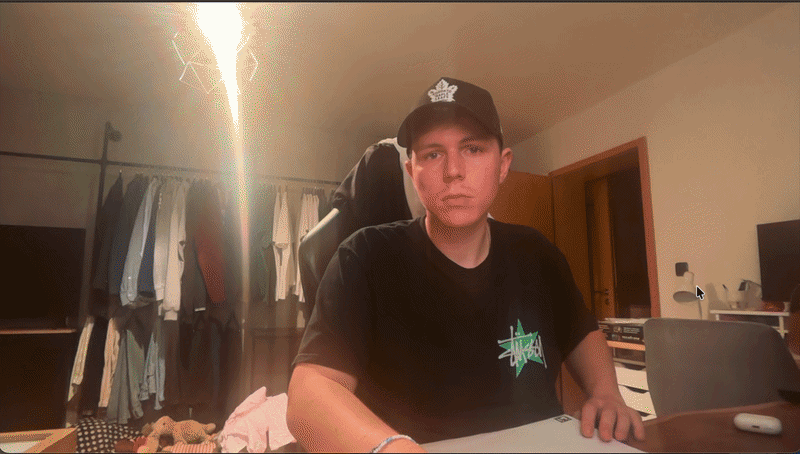

# Image Extractor

## Installation

1. Create a Python virtual environment:

```code
python -m venv venv
```
2. Activate the virtual environment.

#### macOS / Linux
```code
source venv/bin/activate
```
#### Windows

```code
venv\Scripts\activate
```

3. Install all required dependencies from the requirements file:

```code
pip install -r requirements.txt
```
---

## How to Use

Start the program:

```code
python image_extractor.py
```
The program will guide you through several inputs in the command line.

### 1. Source Path

First, enter the path to the source image.

You can either use:
- an absolute path
- or a relative path

Using the complete absolute path is recommended to avoid path issues.

---

### 2. Destination Path

Next, enter the destination path where the extracted image should be saved.

Important:
- The path must include a filename
- The path must include a valid image extension

Supported extensions:
- .jpg
- .jpeg
- .png

---

### 3. Output Resolution

You will then be asked for:
- the output width
- the output height

These values determine the resolution of the transformed image.

---

## Selecting the Image Area

After all inputs are entered:
- the program opens a preview window
- the source image is displayed

Now select exactly four points on the image.

Typically, these four points represent the corners of a document or another rectangular object.

The selected points are automatically sorted internally, so the clicking order does not matter.

After selecting four points:
- a perspective transformation is applied
- the transformed image is displayed

---

## Controls

### ESC

Pressing ESC resets the current selection.

Examples:
- If you are currently selecting points and made a mistake, ESC clears the selected points so you can start again.
- If the transformed image is currently shown, ESC closes the transformed result and returns to the original image preview.

---

### S

When the transformed image is visible:
- press S to save the image to the destination path

---

### Q

Press Q at any time to completely close the program.


# AR Game – Ant Alarm!

<p align="center">
  
</p>


## Installation

If you have not done it already.
Create a virtual environment and install requirements.txt
Follow steps 1-3 of image extractor if you need help.

---

## How to Start

Run the program:

python AR_game.py

After starting the program:
- your webcam feed will open
- the program waits for the game board to appear in the camera

---

## The Game Board

The game board consists of:
- a sheet of paper
- with one ArUco marker in each corner

The playable game area is the area inside the four markers.

Hold the complete board into the webcam view.

Important:
All four ArUco markers must be visible at the same time.

Once all four markers are detected:
- the board is automatically perspective transformed
- the extracted board becomes the active game field
- the game view fills the screen

---

## Perspective Transformation Stability

The ArUco detection runs continuously in the background.

During gameplay it is possible that:
- a hand temporarily covers one of the markers
- a marker briefly disappears from the camera image

To make the game more stable:
- the program stores the previous transformation matrix
- if markers disappear only briefly, the old matrix is reused

Currently the threshold is:

45 frames

This prevents short tracking interruptions while interacting with the game board.

However:
- if a marker is hidden for too long
- or too many markers disappear

the transformation fails.

In this case:
- the program automatically returns to the normal webcam image
- you simply need to show all four markers again

---

## Gameplay – Ant Alarm
Oh no! There are ants on your board! Be quick!

The goal of the game is:
- to touch as many ants as possible with your finger

Ants randomly appear on the game board.

When your finger touches an ant:
- the ant disappears
- a new ant appears at another random position
- your score increases

---

## Starting the Game

Press SPACE to start the game.

You then have 25 seconds to catch as many ants as possible.

At the end of the game:
- your final score is displayed
- the highscore is stored during the session

---

## Restarting

After the game ends R to restart it.
---

## Finger Tracking

Finger tracking is implemented using:
- HSV color masking
- contour detection

The system works best under:
- normal indoor lighting conditions
- evenly lit environments

Very dark lighting or strong overexposure may reduce tracking quality.

During testing, the tracking worked reliably under standard lighting conditions.

---

## Additional Notes

The game board can be:
- removed from the camera
- and shown again at any time

As soon as all four ArUco markers become visible again:
- the board is detected automatically
- and the game continues normally.